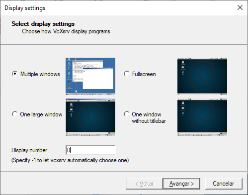

# Instalação do OpenCV-4.0.0 no WSL2
Atualmente é possível encontrar uma série de tutoriais ensinando como instalar o OpenCV. Também é possível perceber que a maior parte dos desenvolvedores desta área utilizam sistemas operacionais Unix, como Linux e o OSX. De uma forma geral, existe uma grande vantagem em utilizar sistema Unix no desenvolvimento de aplicações com o OpenCV: você terá acesso a um maior suporte da comunidade e acesso a uma gama ainda maior de referências e exemplos.

Mesmo sendo um usuário do Windows, me vi na obrigação de utilizar o Linux para facilitar o meu processo de aprendizado em visão computacional. Resgatei minha antiga máquina virtual do Ubuntu e busquei alguns tutoriais para instalar o OpenCV em meu computador. Infelizmente, este processo não foi tão simples como eu esperava. Após diversas tentativas de instalação sem sucesso eu estava pronto para criar uma nova máquina virtual e começar este processo do zero. Foi aí que lembrei do sistema WSL2 disponível agora para o Windows 10 e resolvi dar uma chance a ele.

O Subsistema do Windows para Linux (WSL) permite a execução de um ambiente Linux diretamente no Windows, oferecendo suporte para a maior parte das ferramentas de linha de comando, utilitários e aplicativos. Este recurso elimina a sobrecarga de sistema causada por uma máquina virtual tradicional ou até mesmo a necessidade de uma instalação *dualboot*.

Após pesquisar um pouco, finalmente consegui preparar meu ambiente para trabalhar com o OpenCV utilizando a linguagem Python! Neste documento apresentarei os passos que desenvolvi para a preparação do meu sistema.

## Instalação do Ubuntu 20.04 LTS no WSL2
A instalação de uma distribuição Linux através do WSL2 é bastante simples de realizar. Primeiro, precisei atualizar meu Windows 10 para a versão 2004. Depois, atualizei o *kernel* do WSL para a versão 2. Por fim, instalei o Ubuntu através da própria loja de aplicativos da Microsoft.

Para maiores instruções sobre este processo de instalação, consulte o [Guia de instalação do Subsistema Windows para Linux para Windows 10](https://docs.microsoft.com/pt-br/windows/wsl/install-win10) disponibilizado pela Microsoft.

## Instalação do OpenCV-4.0.0 no Ubuntu
Instalar o OpenCV em distribuições Linux está cada vez mais fácil, pois já existem bibliotecas pré-compiladas e disponíveis para instalação de repositórios. Porém, recomenda-se baixar a versão mais recente do código fonte do OpenCV e instalá-lo manualmente para ter acesso à otimizações da biblioteca, módulos mais compactos e muitas melhorias no módulo de Rede Neural Profunda (DNN).

Para realizar este processo, recomendo o [tutorial de instalação do OpenCV no Ubuntu](https://www.pyimagesearch.com/2018/08/15/how-to-install-opencv-4-on-ubuntu/) disponibilizado pela [PyImageSearch](https://www.pyimagesearch.com/about/).

## Suporte Gráfico para o WSL2
WSL não oferece suporte nativo a gráficos. Em sistemas Linux, o recurso responsável for oferecer suporte gráfico, *mouse* e teclado é o chamado *Xserver*. Podemos, no entanto, executar este serviço no próprio Windows e executar aplicativos clientes no WSL2. 

Estou usando o [VcXsrv Windows X Server](https://sourceforge.net/projects/vcxsrv/) que é uma ferramenta de código aberto e é atualizada com frequência. Se preferir, você também pode usar o [Xming](https://sourceforge.net/projects/xming/), [MobaXterm](https://mobaxterm.mobatek.net/), [Cygwin/X](https://x.cygwin.com/), entre outros.

Para oferecer este suporte gráfico ao WSL, o primeiro passo é instalar o gerenciador gráfico de sua escolha. Em seguida, configure o endereço de saída gráfica do seu sistema WSL por meio dos seguintes comandos:

~~~
$ echo '# X-Server Display Port Address' >> ~/.bashrc 
$ echo 'export DISPLAY=$(grep -m 1 nameserver /etc/resolv.conf | awk '{print $2}'):0.0' >> ~/.bashrc 
$ source ~/.bashrc
~~~

Se você optar pelo uso da ferramenta VcXsrv, certifique-se de utilizar a seguinte configuração:
* Ao abrir a aplicação, selecione a opção "Multiple windows" e defina o campo "Display number" como 0.

**Figura 1.** Configuração de janela do VcXsrv

* Selecione a opção "Start no client".

**Figura 2.** Configuração de inicialização do VcXsrv

* Marque as opções "Clipboard", "Primary Selection", "Native opengl" e "Disable access control".

**Figura 3.** Configurações adicionais do VcXsrv

Pronto! Agora, resta apenas manter seu Xserver ativo no Windows sempre que você for utilizar recursos gráficos no WSL.

## Limitações Conhecidas
Sem dúvida, utilizar o WSL2 como o sistema Linux de desenvolvimento para o OpenCV não é tão bom quanto utilizar uma instalação nativa. Porém, esta se mostrou uma alternativa bastante prática para iniciar meus estudos em visão computacional. Desde que iniciei este processo, identifiquei algumas limitações desta configuração que merecem atenção.

### Problemas no dimensionamento de janelas
Pude perceber durante minhas atividades que, eventualmente, o OpenCV apresenta imagens em tela com o dimensionamento de janela incorreto. Como consequência, temos a impressão de imagens aparentemente "cortadas" em tela. Após pesquisar pela internet, não consegui encontrar outros desenvolvedores com o mesmo problema, o que me leva a acreditar que esta é uma particularidade do meu ambiente com o WSL2.

Ainda não consegui solucionar a raiz do problema, mas identifiquei uma forma de contorná-lo. Uma vez que o problema está relacionado ao dimensionamento de telas, podemos desabilitar o dimensionamento automático das janelas do OpenCV e definir suas dimensões no código em execução. Mesmo que a falha ocorra durante a execução de um programa, desabilitar o dimensionamento automático de telas permite que o usuário ajuste ou até maximize o tamanho de telas manualmente.

**Figura 4.** Janela com tamanho original

**Figura 5.** Janela com tamanho incorreto

Esta solução exige que dois comandos sejam adicionados ao seu código:
* cv2.namedWindow(): esta função cria uma nova janela de imagem com o nome desejado e permite configurar o tipo de janela a ser criado. Neste segundo parâmetro devemos inserir o argumento "cv2.WINDOW_NORMAL" para habilitar seu redimensionamento.
* cv2.resizeWindow(): esta função nos permite redimensionar uma janela e deverá ser chamada ao longo do código conforme necessário. Seus parâmetros incluem o nome da janela a ser redimensionada, sua largura e sua altura.

**Figura 6.** Janela com tamanho redimensionado

### Suporte de acesso ao hardware limitado
O suporte de acesso ao hardware pelo WSL2 ainda é bastante limitado, por exemplo: você não conseguirá acessar a serial, webcams ou dispositivos USB em geral.

## Referências

Adrian Rosebrock. How to install OpenCV 4 on Ubuntu. PyImageSearch. Disponível em: https://www.pyimagesearch.com/2018/08/15/how-to-install-opencv-4-on-ubuntu/. Acesso em: 13 set. de 2020.

Guia de instalação do Subsistema Windows para Linux para Windows 10. Microsoft Docs. Disponível em: https://docs.microsoft.com/pt-br/windows/wsl/install-win10. Acesso em: 13 set. de 2020.

Mianzhi Wang. Setting Up WSL with Graphics and Audio. Disponível em: https://research.wmz.ninja/articles/2017/11/setting-up-wsl-with-graphics-and-audio.html. Acesso em: 13 set. de 2020.

Can't use X-Server in WSL 2 #4106. Microsoft WSL on GitHub. Disponível em: https://github.com/microsoft/WSL/issues/4106. Acesso em: 13 set. de 2020.
